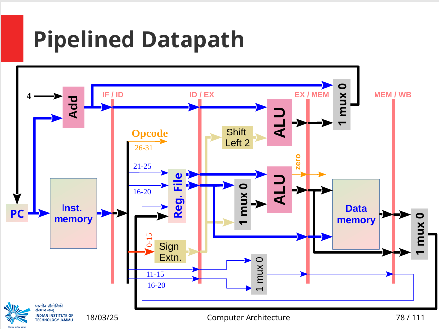
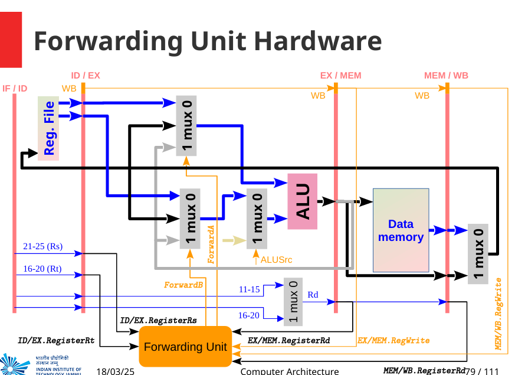
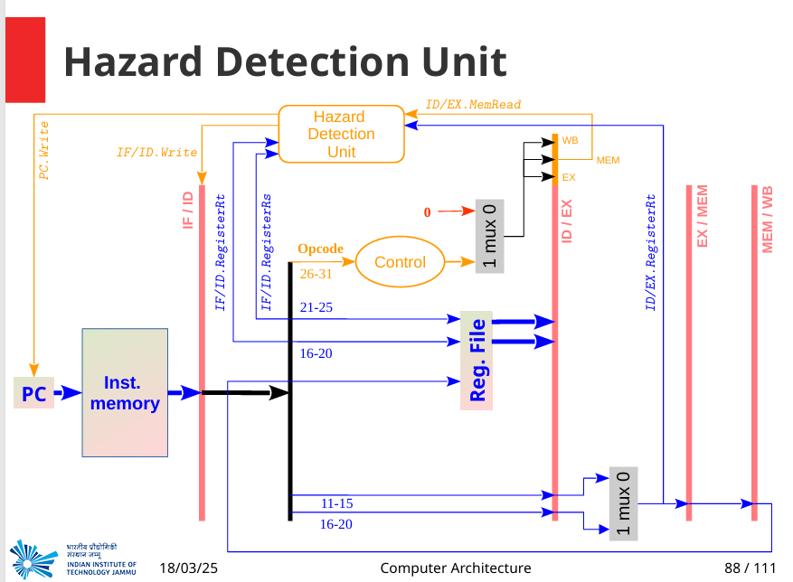
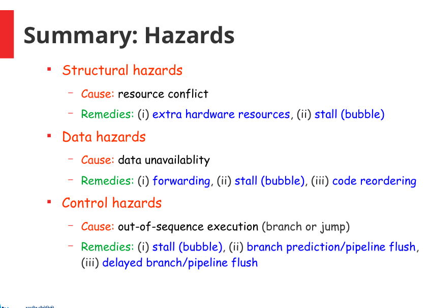

# MIPS Pipelined Processor – Hazard-Resolved – Harshdeep Singh

This repository implements a **5-stage pipelined 32-bit MIPS CPU** in Verilog, complete with hardware to automatically detect and resolve data and control hazards (forwarding & stalling).

Supported instructions (17 total):
1. `add`  
2. `sub`  
3. `and`  
4. `or`  
5. `lw`  
6. `sw`  
7. `slt`  
8. `sltiu`  
9. `srl`  
10. `lhu`  
11. `beq`  
12. `bne`  
13. `j`  
14. `jal`  
15. *(repeat)* `add`  
16. *(repeat)* `sub`  
17. *(repeat)* `and`  

---

## 📁 Repository Layout

```text
MIPS_Pipelined_WithHazards/
├── src/
│   ├── pipelined_processor.v     # Top-level 5-stage pipeline + hazard logic
│   ├── pc.v                      # Program Counter (with stall enable)
│   ├── adder.v                   # PC+4 adder
│   ├── instr_mem.v               # Instruction memory (256×32)
│   ├── if_id_reg.v               # IF/ID pipeline register (stall & flush)
│   ├── control_unit.v            # Opcode → core control signals
│   ├── hazard_detection_unit.v   # Detects load-use & branch hazards, generates stalls
│   ├── forwarding_unit.v         # ALU-ALU & MEM→EX forwarding control
│   ├── reg_file.v                # 32×32 register file (sync write, async read)
│   ├── sign_ext.v                # Sign/zero-extender
│   ├── shift_left_2.v            # Branch offset shifter
│   ├── shift_left_2_jump.v       # Jump target shifter
│   ├── if_id_reg.v               # IF/ID register
│   ├── id_ex_reg.v               # ID/EX register (flushable)
│   ├── ex_mem_reg.v              # EX/MEM register
│   ├── mem_wb_reg.v              # MEM/WB register
│   ├── alu_control.v             # ALUOp+funct → ALU control code
│   ├── mux_alu_src.v             # ALU B-operand mux
│   ├── main_alu.v                # ALU core (AND, OR, ADD, SUB, SLT, SRL, SLTIU)
│   ├── alu_bj.v                  # Branch-target adder (PC+4 + offset)
│   ├── regdst_mux.v              # RegDst mux (rt/rd/$ra)
│   ├── datamem.v                 # Data memory (word & half-word)
│   ├── mux_memtoreg.v            # MemtoReg mux (ALU/MEM/PC+4)
│   ├── mux_br_sel.v              # Branch decision mux
│   └── mux_jump_sel.v            # Final PC mux (branch/jump/default)
├── img/
│   ├── Screenshot 2025-05-13 182929.png   # 🖼️ Pipelined Datapath
│   ├── Screenshot 2025-05-13 182935.png   # 🖼️ Forwarding Unit Hardware
│   ├── Screenshot 2025-05-13 182945.png   # 🖼️ Hazard Detection Unit
│   └── Screenshot 2025-05-13 183018.png   # 🖼️ Summary: Hazards & Solutions
├── tb/
│   ├── pipelined_processor_tb.v  # Testbench & waveform logger
│   └── program1.mem              # 17 instruction hex words
└── README.md
```

## 🖼️ Datapath & Hazard-Resolution Units

*Blue = data paths* | *Orange = control & stall/forward signals*

## Pipelined Datapath  


## Forwarding Unit Hardware  


## Hazard Detection Unit  


## Hazards & Solutions Summary  


## 🎛️ Control & Stall/Forward Signals

### Single-Bit Signals

| Signal       | 0 (disabled)                        | 1 (enabled)                              |
|--------------|-------------------------------------|-------------------------------------------|
| **RegDst**   | write register = `rt`               | write register = `rd` (or `$ra` if `Jal=1`) |
| **Jump**     | PC ← PC+4                           | PC ← jump target                          |
| **Branch**   | PC ← PC+4                           | PC ← branch target if `Zero⊕Bne`           |
| **MemRead**  | no memory read                      | read from data memory                     |
| **MemWrite** | no memory write                     | write to data memory                      |
| **MemtoReg** | WB ← ALU result                     | WB ← memory data                          |
| **ALUSrc**   | ALU B = register                    | ALU B = immediate                         |
| **RegWrite** | no register write                   | enable register write                     |
| **Jal**      | normal WB                           | write PC+4 into `$ra`                     |
| **Bne**      | BEQ semantics                       | BNE semantics                             |
| **ExtSel**   | sign-extend immediate               | zero-extend immediate                     |

### Two-Bit Signals

| Signal    | `00`                              | `01`                      | `10`                   | `11`      |
|-----------|-----------------------------------|---------------------------|------------------------|-----------|
| **ALUOp** | ADD (PC+4, `lw`/`sw`/`jal`)       | SUB (`beq`/`bne`)         | R-type (use `funct`)   | SLTIU     |
| **mem_mode** | word access (`lw`/`sw`)        | half-word (`lhu`)         | —                      | —         |

### Stall & Forwarding Controls

| Unit                       | Purpose                                                      |
|----------------------------|--------------------------------------------------------------|
| **hazard_detection_unit**  | Detects load-use & branch hazards → stalls IF/ID & PC        |
| **forwarding_unit**        | Forwards EX/MEM or MEM/WB ALU results back into EX stage     |
| **if_id_reg**              | `if_id_write=0` to stall fetch/decode, `flush=1` to insert NOP |
| **id_ex_reg**              | `ControlHazard=1` to convert EX inputs into a NOP            |


## 📝 Module Descriptions

Below is a brief overview of each Verilog module in `src/`:

### `pipelined_processor.v`  
Top-level that instantiates the five pipeline stages (IF, ID, EX, MEM, WB) plus the **Hazard Detection** and **Forwarding** units to resolve data and control hazards.

---

### `pc.v`  
**Program Counter**  
- Registers the current PC (`pc_out`)  
- On each rising clock edge:  
  - If `reset` = 1 → `pc_out` ← 0  
  - Else if `pc_write` = 1 → `pc_out` ← `pc_in`  
  - Else → hold (stall)  

---

### `adder.v`  
**PC Adder**  
- Combinational: `pc_next = pc_out + 4`  

---

### `instr_mem.v`  
**Instruction Memory**  
- 256×32-bit word-addressed read-only array  
- Asynchronously outputs `instruction = memory[ pc_out>>2 ]`  

---

### `if_id_reg.v`  
**IF/ID Pipeline Register**  
- On rising clock:  
  - If `reset` or `flush` = 1 → outputs ← 0 (inject NOP)  
  - Else if `if_id_write` = 1 → latch new `{ instruction, pc+4 }`  
  - Else → hold (stall decode)  

---

### `control_unit.v`  
**Main Decoder**  
- Input: 6-bit opcode  
- Outputs all control signals (`RegDst`, `ALUSrc`, `MemRead`, … ) for R-type, I-type, branch, jump, load, store, SLTIU, LHU, JAL.  

---

### `hazard_detection_unit.v`  
**Hazard Detection & Stall Logic**  
- **Load–Use Hazard**:  
  - If ID/EX stage is loading (`ID_EX_MemRead`) *and* its `Rt` matches the IF/ID source (`Rs` or `Rt`), then:  
    - `pc_write = 0` (stall PC)  
    - `if_id_write = 0` (stall IF/ID)  
    - `ControlHazard = 1` (inject bubble in ID/EX)  
- **Control Hazard (Branch taken)**:  
  - If branch decision (`take_branch`) is asserted in ID stage, then:  
    - `flush = 1` (flush IF/ID & ID/EX)  
    - Allow PC to update to target  
- **Forwarding Controls**:  
  - Pass through the resolved `ForwardA` and `ForwardB` signals from the same combinational logic block (see below).  

---

### `forwarding_unit.v`  
**Data-Forwarding Logic**  
- Prevents RAW stalls by selecting the most recent value for each ALU operand:  
  1. **EX→EX** bypass: if EX/MEM writes to a register that ID/EX needs, set `ForwardX = 2'b10`.  
  2. **MEM→EX** bypass: if MEM/WB writes to a register that ID/EX needs (and no EX hazard), set `ForwardX = 2'b01`.  
- Outputs two 2-bit codes:  
  - `ForwardA` for ALU input A  
  - `ForwardB` for ALU input B  

---

### `reg_file.v`  
**Register File**  
- 32×32 array  
- **Read**: asynchronous—combinational reads `reg_array[rs]`, `reg_array[rt]`  
- **Write**: on rising clock, if `RegWrite_final` = 1 and `write_reg_wb` ≠ 0  

---

### `sign_ext.v`  
**Immediate Extender**  
- Extracts bits [15:0] of instruction  
- Under `ExtSel` control: sign- or zero-extends to 32 bits  

---

### `shift_left_2.v` & `shift_left_2_jump.v`  
- **shift_left_2.v**: branch offset = `imm_ext << 2`  
- **shift_left_2_jump.v**: jump target field = `instr[25:0] << 2`  

---

### `id_ex_reg.v` / `ex_mem_reg.v` / `mem_wb_reg.v`  
**Pipeline Registers**  
- **ID/EX**: latches register operands, immediate, control signals; uses `ControlHazard` to insert NOPs on stalls/flushes  
- **EX/MEM**: latches ALU result, Zero flag, branch/jump targets, write-dest, control signals; computes full jump target (`{PC[31:28], shifted}`)  
- **MEM/WB**: latches data-memory output, ALU result, write-dest, and final write-back controls (`RegWrite_final`, `MemtoReg_final`, `Jal_WB`)  

---

### `alu_control.v`  
**ALU Control Decoder**  
- Inputs: `ALUOp` (2 bits) + `funct` (6 bits for R-type)  
- Output: 4-bit `ALUControl` code (ADD, SUB, AND, OR, SLT, SRL, SLTIU)  

---

### `mux_alu_src.v`  
**ALU Source B Mux**  
- Selects between forwarded register value (`forwardB_out`) or immediate (`imm_ext_out`) based on `ALUSrc_out`  

---

### `main_alu.v`  
**ALU Core**  
- Performs the operation specified by `ALUControl`  
- Produces 32-bit result and `Zero` flag  

---

### `alu_bj.v` & `branch_target_adder.v`  
- **alu_bj.v**: adds EX-stage PC+4 and shifted immediate → `branch_addr`  
- **branch_target_adder.v**: same function in ID stage variant (for earlier branch)  

---

### `regdst_mux.v`  
**Destination Register Mux**  
- Chooses write-dest = `rt`, `rd`, or `$ra` (for JAL)  

---

### `mux_memtoreg.v`  
**Write-Back Data Mux**  
- Chooses between ALU result, data-memory output, or PC+4 (for JAL)  

---

### `mux_br_sel.v`  
**Branch Mux**  
- Selects next PC = sequential (`pc+4`) or branch target based on `Branch_out`, `Zero_out`, `Bne_out`, and `valid_MEM`  

---

### `mux_jump_sel.v`  
**Jump Mux**  
- Final PC selector: if `Jump_out`=1 use jump target, else if branch use branch result, else sequential PC+4  

---

<sub>All modules are instantiated in `pipelined_processor.v` in the correct order to build a fully hazard-resolved 5-stage MIPS pipeline.  
</sub>


## 🖥️ Program Memory (`tb/program1.mem`)

```text
014B4820  // I1   add   $t1, $t2, $t3
016C5022  // I2   sub   $t2, $t3, $t4
01CD5824  // I3   and   $t3, $t6, $t5
01F46825  // I4   or    $t5, $t7, $a0
0235C82A  // I5   slt   $t9, $s1, $s5
8D0C0000  // I6   lw    $t4, 0($t0)
AD2E0004  // I7   sw    $t6, 4($t1)
2D0D0005  // I8   sltiu $t5, $t0, 5
950E0002  // I9   lhu   $t6, 2($t0)
12560002  // I10  beq   $s2, $s6, +2
1673FFFC  // I11  bne   $s3, $s3, -4
08000010  // I12  j     0x40
0C000011  // I13  jal   0x44
01AA5820  // I14  add   $t3, $t5, $t2
020C6822  // I15  sub   $t5, $s0, $t4
01EF7025  // I16  or    $t6, $t7, $t7
0307C824  // I17  and   $t9, $t8, $t7
``` 

##🔧 Testbench Initializations ('tb/pipelined_processor_tb.v')
```text

initial begin
    // 1. Reset & clock
    clk   = 0;  
    reset = 1;  
    #10   reset = 0;

    // 2. Preload register file
    uut.REGFILE.reg_array[ 0] = 32'd0;   // $zero
    uut.REGFILE.reg_array[ 8] = 32'd5;   // $t0
    uut.REGFILE.reg_array[ 9] = 32'd3;   // $t1
    uut.REGFILE.reg_array[10] = 32'd5;   // $t2
    uut.REGFILE.reg_array[11] = 32'd6;   // $t3
    uut.REGFILE.reg_array[12] = 32'd7;   // $t4
    uut.REGFILE.reg_array[13] = 32'd2;   // $t5
    uut.REGFILE.reg_array[14] = 32'd1;   // $t6
    uut.REGFILE.reg_array[15] = 32'd7;   // $t7
    uut.REGFILE.reg_array[16] = 32'd6;   // $s0
    uut.REGFILE.reg_array[17] = 32'd0;   // $s1 (set by SRL)
    uut.REGFILE.reg_array[18] = 32'd8;   // $s2
    uut.REGFILE.reg_array[19] = 32'd8;   // $s3

    // 3. Preload data memory
    uut.MEM.memory[0] = 32'h0000ABCD;
    uut.MEM.memory[1] = 32'hDEADBEEF;
    uut.MEM.memory[2] = 32'hCAFEBABE;
    uut.MEM.memory[3] = 32'h12345678;
    uut.MEM.memory[4] = 32'h87654321;
    uut.MEM.memory[5] = 32'h0000000F;
    uut.MEM.memory[6] = 32'hFFFFFFFF;
    uut.MEM.memory[7] = 32'h00000ABC;
    uut.MEM.memory[8] = 32'h12312312;
    uut.MEM.memory[9] = 32'hDEDEDEDE;

    // 4. Load instructions
    $readmemh("program1.mem", uut.IMEM.memory);

    // 5. Run ~50 cycles, display PC, IF instr, and key registers
    for (i = 0; i < 50; i = i + 1) begin
        @(posedge clk);
        $display("T=%0t PC=0x%08h IF=0x%08h | $t0=%0d $t1=%0d $t3=%0d $t5=%0d $ra=%0d",
                 $time, uut.pc_out, uut.instruction,
                 uut.REGFILE.reg_array[8],
                 uut.REGFILE.reg_array[9],
                 uut.REGFILE.reg_array[11],
                 uut.REGFILE.reg_array[13],
                 uut.REGFILE.reg_array[31]);
    end

    $finish;
end
```
